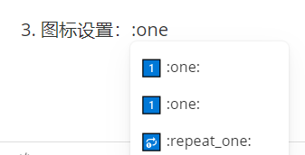

# 编好设置

1. 自动保存设置

   

2. 图片保存地址设置


3. 显示代码块行号


4. 高亮


# 一、多级标题

# 多级标题 ctrl+0 从标题变回普通文字，清除标题效果

# #这是第一级标题，一个#然后空格号

## ##这是第二级标题，两个#然后空格

### ###这是第三级标题，依次类推

#   快捷键方式：ctrl+1得到一级标题

######     ctrl+6得到六级标题

### 普通文字变标题，选中目标行 ，然后ctrl+1~6，按ctrl+n会自动切换标题的等级


# 二、有序列表

1. 数字+点+空格，变成有序列表
2. 然后按一下enter键，自动产生序号

连续按下两下enter键，序号会自动取消

3. 中间插入，会自动调整编号，可以按数字+点+空格，再次延续序号列表

   1. 按enter，再按tab，生成嵌套有序编号，也称降级序号

4. 按enter，再按shift+tab，回到上一级有序列表，也称升级序号

5. 快捷键：先选中所有要标序号的行，然后按：ctrl+shift+[，不是很好用，容易互相污染

   

   测试快捷键1

   测试快捷键2

   测试快捷键2

   

# 三、无序列表

* 输入*或-号，然后空格，就会生成无序列表

  1. 生成有序列表后，再按tab键，可以形成降级效果

* - - - 连续按*或,-号，然后空格，图标会自动降级变换，

* 连续按两下enter键，会自动升级

  * 也可以按enter然后按tab降级

* 也可以按enter 然后按shift+tab升级

* 快捷键：ctrl+shift+]

  1. 测试有序快捷键1

  2. 测试有序快捷键2

     - 测试无序列表快捷键

     - 测试无序列表快捷键2

     - ## 标题效果图标不生效


# 四、任务列表

- [ ] -空格[空格]空格，三个空格不能少
- [x] 第二任务列表标识会自动出现

两个enter，会取消框框

- [ ] 按tab不会降级

- [x] ## 标题效果，框框不生效

- [ ] 任务列表没有快捷键

  

# 五、表格

创建方式：

1. 先输入：|学生|姓名|性别|
2. 然后输入：enter键

| 学号 | 姓名 | 性别 |
| ---- | ---- | ---- |
| 001  | 张三 | 男   |
|      |      |      |
| 002  | 李红 | 女   |

若要添加一行，先聚焦表格，然后按：Ctrl+Enter，就会在选中行之后，新建一行。

按Ctrl+z键，退回前一步操作

鼠标右键表格，可以对表格进行更多操作，

表格快捷键，Ctrl+t，按下Ctrl+t，弹框输入函数和列数


# 六、行内代码

1. 创建方式：`行内代码`，用反单引号括起来的内容，在键盘上的esc按键下面
2. 按反单引号时，不要按`shift`键，且必须是英文格式
3. 快捷键：==Ctrl+Shift+`==，此快捷，在选中单词上直接按下即可，并且可以来回切换


# 七、代码块


1. 创建方式：```java 或~~~java
2. 三个反单引号+程序语言类型名称，最后按回车

```java
public class HellWorld{
    public static void main(String[] args){
        System.out.println("Hello World");
    }
}
```

3. 快捷键：==Ctrl+Shoft+k==

```javascript
public class HellWorld{
    public static void main(String[] args){
        System.out.println("Hello World");
    }
}
```


# 八、高亮、图标、图片

1. 高亮设置：==高亮内容==

   

2. 用四个等于号包裹高亮内容
3. 图标设置：:one:，用两个冒号设置图标​




4. 更多图标：https://www.cnblogs.com/wangjs-jacky/p/12011208.html

   

5. 选择图片：

6. 按下英文的：! [] () ，中间不用加空格，再按enter键，就会出现图片选择按钮

7. 图片选择快捷键：==Ctrl+Shift+i==


8. 通常图片可以进行复制粘贴，


# 九、以上操作需要做好偏好设置


# 十、学习地址：

https://www.bilibili.com/video/BV1jE411n7KJ/?spm_id_from=333.1387.favlist.content.click&vd_source=ceb0a546a38224e57ddb040c48399f26

https://www.bilibili.com/video/BV1kq4y1y7Hn/?spm_id_from=333.1387.favlist.content.click
